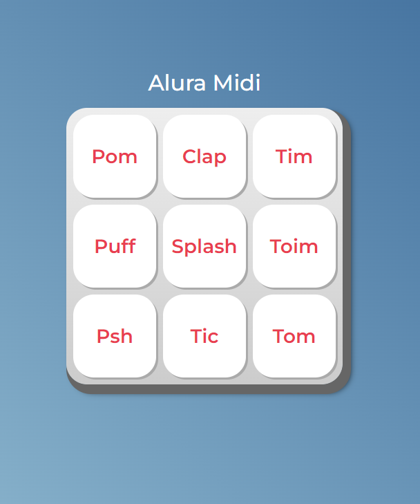

<h1 align="center">AluraMidi</h1>

## :dart: Objetivos do Estudo
Projeto elaborado com base no curso "JavaScript para Web: Crie páginas dinâmicas" da plataforma Alura que faz parte da formação "Desenvolva aplicações Web com JavaScript", nesta aplicação foi ensinado as seguintes funções:

- Conhecendo JavaScript
    - Conectar JS com o HTML
    - Buscar um elemento
    - Para que serve o DevTools?
    - Para saber mais: HTML x CSS x JavaScript

- Funções
    - Play no JS
    - O que é uma função?
    - O local da tag script?
    - Clique no botão

- Listas
    - Lista de elementos
    - Porque o document.querySelectorAll()?
    - Conhecendo listas

- Iterando Listas
    - Percorrendo uma lista
    - Porque usamos os while?
    - Funções com parâmetros
    - O que é parâmetro de uma função?
    - Funções anônimas
    - Textos dinâmicos
    - Repetição otimizada com For

- Eventos de Lógica
    - Eventos do teclado
    - Adicionando e removendo classe
    - Faça como eu fiz: Modificando estilos com JavaScript
    - Condições no código
    - Operador lógico
    - Mais condições
    - Estruturas condicionais
    - Melhorando o código
    - Projeto final do curso

## :heavy_check_mark: Design do Projeto

